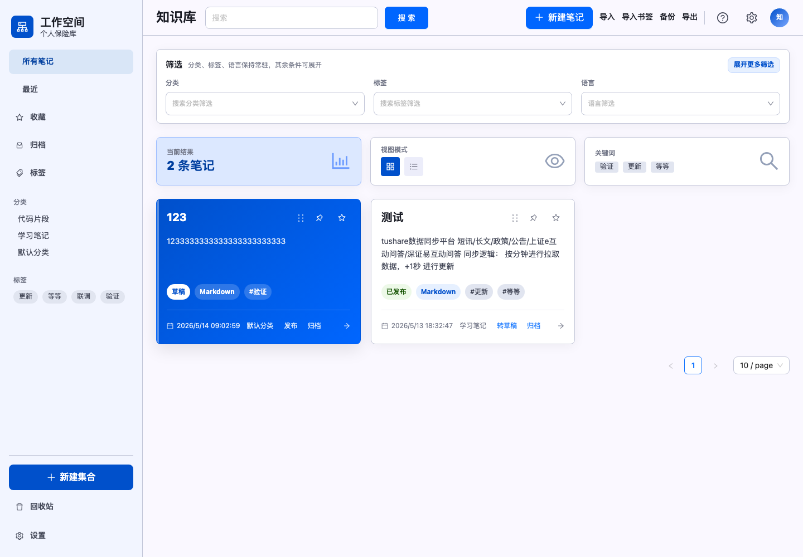
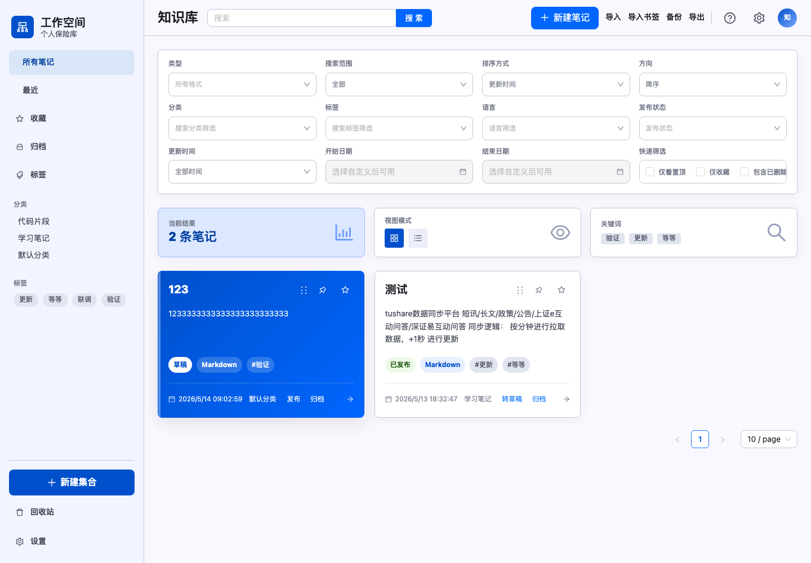
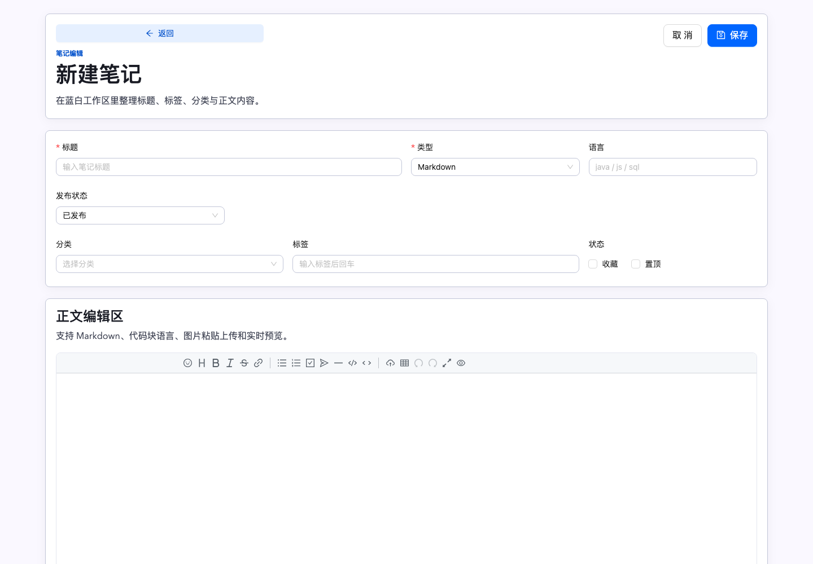
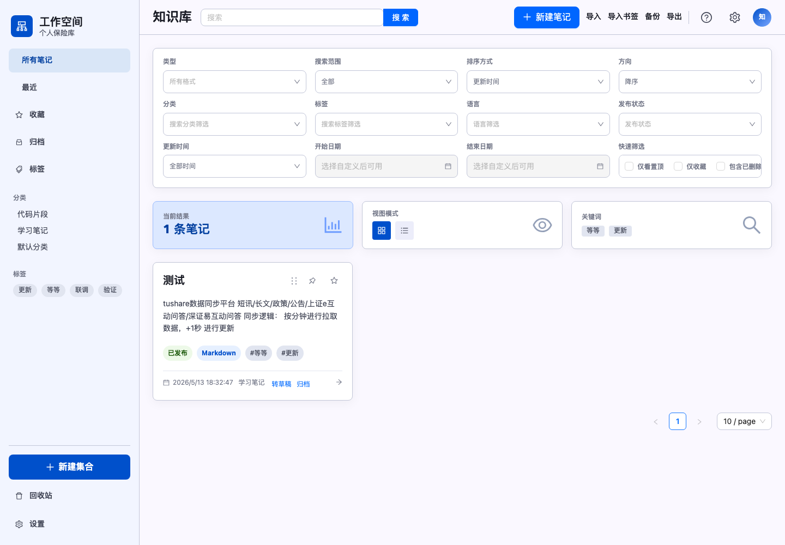

# People Wiki 个人知识库

People Wiki 是一个运行在个人电脑上的本地知识库系统，用来管理 Markdown 笔记、代码片段、浏览器书签和图片资源。系统采用 Spring Boot + Vue 3 构建，数据默认持久化到用户目录下的 H2 文件数据库，并通过 Apache Lucene 提供本地全文检索能力，向量语义检索和混合检索模式。

项目目标是“开箱即用、离线可用、可备份恢复”：开发阶段可以前后端分离运行，部署阶段可以打成单一可执行 Jar，启动后直接访问浏览器页面。

## 功能概览

- 笔记管理：创建、编辑、详情查看、逻辑删除、恢复、永久删除。
- Markdown 编辑：Vditor 编辑器、Markdown 预览、代码高亮、图片粘贴上传。
- 分类与标签：分类树、标签云、分类管理、标签筛选。
- 草稿与发布：草稿使用蓝色卡片，已发布使用白色卡片，支持发布 / 转草稿。
- 收藏与置顶：列表和详情页均可快速切换收藏、置顶状态。
- 归档与回收站：归档笔记默认不进入全部列表，回收站支持恢复和永久删除。
- 智能搜索：统一搜索入口支持精确全文、语义搜索和混合搜索，结果展示命中来源、相关度和排序解释。
- 知识库问答：基于混合搜索召回笔记片段，再调用阿里百炼或 DeepSeek 生成带引用回答。
- 知识发现：详情页展示“可能相关”笔记，优先语义向量，回退全文相似和标签 / 分类元数据。
- 搜索体验：搜索历史、常用搜索、清空历史和一键复制搜索条件。
- LLM 总结：支持阿里百炼和 DeepSeek，为笔记生成摘要、标签和分类建议。
- 版本历史：编辑自动保存历史版本，支持查看与恢复。
- 导入导出：Markdown 导入、书签 HTML 导入、链接导入预览、Markdown / ZIP 导出。
- 备份维护：数据、索引、图片目录一键备份，支持启动时恢复备份。

## 页面预览

### 工作台首页

首页采用蓝白色工作台布局，左侧为导航、分类和标签，顶部提供搜索、导入导出、备份和设置入口。筛选区默认只保留分类、标签、语言，更多条件可展开。



### 笔记卡片

蓝色卡片表示草稿状态，白色卡片表示已发布状态。卡片底部展示更新时间、分类、发布/归档操作。



### 新建笔记

新建笔记页提供标题、类型、语言、发布状态、分类、标签、收藏和置顶配置，下方是 Vditor 正文编辑区，支持 Markdown、代码块、图片粘贴上传和实时预览。



### 完整筛选面板

展开后可使用类型、搜索范围、排序、发布状态、更新时间范围、置顶、收藏、已删除等高级筛选。



## 智能搜索

工作台顶部搜索区支持三种搜索模式：

- 精确全文：基于 Lucene BM25，在标题、正文、代码和分类字段中检索关键词。
- 语义搜索：基于本地 Embedding 向量索引，用自然语言问题匹配语义相近的笔记。
- 混合搜索：融合 Lucene 关键词得分与向量相似度，并叠加标题命中、标签命中、置顶、收藏和最近更新等轻量加权。

统一搜索 API：

```text
GET /api/search?mode=exact&q=Java&scope=all
GET /api/search?mode=semantic&q=怎么设计接口
GET /api/search?mode=hybrid&q=Java接口&tag=spring
```

兼容入口仍然保留：

```text
GET /api/search/semantic?q=怎么设计接口
GET /api/search/hybrid?q=Java接口
```

混合搜索结果会返回 `keywordScore`、`semanticSimilarity`、`hybridScore` 和 `rankExplanation`，前端卡片会展示“命中来源 / 全文分 / 语义分 / 综合分 / 为什么命中”，便于判断排序原因。

## 技术架构

### 后端

- Java 17
- Spring Boot 3.5.x
- Spring Web
- Spring Data JPA
- Hibernate
- H2 文件数据库
- Apache Lucene 9.12.2
- Bean Validation
- Maven

后端包名为 `com.knowledgebase`，主要分层如下：

```text
controller   REST API 与 SPA 路由转发
service      笔记、搜索、索引、备份、导入导出等业务逻辑
repository   Spring Data JPA 数据访问
entity       Note、Category、Tag、NoteHistory 等实体
dto          请求与响应对象
config       数据目录、索引、初始化、迁移与备份恢复配置
exception    统一异常处理
util         Markdown 文本提取、Lucene 字段定义等工具
```

### 前端

- Vue 3
- Vite
- TypeScript
- Vue Router
- Axios
- Ant Design Vue
- Ant Design Icons Vue
- Vditor
- highlight.js

前端位于 `frontend/`，核心页面包括：

```text
NoteListView.vue    工作台首页、搜索、问知识库、搜索历史、筛选、列表、归档、回收站
NoteDetailView.vue  笔记详情、Markdown 渲染、历史版本、相似笔记、状态操作
NoteEditView.vue    新建和编辑笔记、Vditor 编辑器、图片上传
SettingsView.vue    设置维护、索引健康检查、索引重建、向量清理、备份恢复说明
```

### 数据与存储

默认数据目录：

```text
~/.knowledge-base/data/knowledge-base.mv.db   H2 数据库文件
~/.knowledge-base/index                       Lucene 索引目录
~/.knowledge-base/vector-index                Lucene 向量索引目录
~/.knowledge-base/images                      图片资源目录
```

可通过环境变量覆盖：

```bash
export KNOWLEDGE_BASE_DATA_PATH=/your/path/data/knowledge-base
export KNOWLEDGE_BASE_INDEX_PATH=/your/path/index
export KNOWLEDGE_BASE_VECTOR_INDEX_PATH=/your/path/vector-index
export KNOWLEDGE_BASE_IMAGES_PATH=/your/path/images
```

### 本地 Embedding 向量索引配置

第七阶段向量化默认使用 `local-cli`，通过本地 llama.cpp `llama-embedding` 命令行工具生成向量。项目不内置也不自动下载模型文件，需要先自行准备 llama.cpp 可执行文件和 GGUF Embedding 模型。

```bash
export KNOWLEDGE_BASE_EMBEDDING_PROVIDER=local-cli
export KNOWLEDGE_BASE_EMBEDDING_LOCAL_CLI_EXECUTABLE=/your/path/llama-embedding
export KNOWLEDGE_BASE_EMBEDDING_LOCAL_CLI_MODEL=/your/path/model.gguf
export KNOWLEDGE_BASE_EMBEDDING_LOCAL_CLI_POOLING=mean
export KNOWLEDGE_BASE_EMBEDDING_LOCAL_CLI_NORMALIZE=true
export KNOWLEDGE_BASE_EMBEDDING_LOCAL_CLI_TIMEOUT_SECONDS=120
```

未配置本地模型时，系统会自动降级为现有 Lucene 全文搜索；设置页会展示向量索引配置状态，并提供手动重建向量索引入口。

完成配置后，可以在设置页重建向量索引，也可以调用：

```text
POST /api/admin/vector-index/rebuild
POST /api/admin/vector-index/cleanup
GET /api/admin/index-health
```

### LLM 总结与知识库问答配置

LLM 总结和“问知识库”接口使用 OpenAI 兼容的 Chat Completions 协议，当前支持阿里百炼和 DeepSeek。默认供应商为阿里百炼，可通过环境变量切换。

```bash
# 默认供应商：bailian 或 deepseek
export KNOWLEDGE_BASE_LLM_PROVIDER=bailian

# 阿里百炼
export BAILIAN_API_KEY=你的百炼APIKey
export BAILIAN_MODEL=qwen-plus
export BAILIAN_BASE_URL=https://dashscope.aliyuncs.com/compatible-mode/v1

# DeepSeek
export DEEPSEEK_API_KEY=你的DeepSeekAPIKey
export DEEPSEEK_MODEL=deepseek-v4-flash
export DEEPSEEK_BASE_URL=https://api.deepseek.com
```

未配置 API Key 时，前端仍会显示入口，但调用总结或问答会返回配置提示，不影响普通笔记、全文搜索、语义搜索和混合搜索。

知识库问答 API：

```text
POST /api/knowledge-qa
```

请求会先按问题和筛选条件执行混合搜索，召回相关笔记，再调用 LLM 生成回答。响应包含 `answer`、`provider`、`model` 和 `citations`；每个引用包含笔记 ID、标题、命中片段和详情页链接。前端“问知识库”面板支持连续提问、查看引用并跳转原文。

相似笔记 API：

```text
GET /api/notes/{id}/similar?limit=6
```

相似推荐优先使用向量相似度；向量未配置或不可用时，会回退到 Lucene MoreLikeThis 和标签 / 分类重合度，详情页“可能相关”区域会展示推荐原因和来源。

## 链接导入

工作台首页“更多”菜单提供“导入链接”入口。输入网页 URL 并选择 LLM 供应商后，后端会抓取网页正文，移除导航、脚本、样式、页脚等噪声内容，再调用 LLM 生成标题、摘要、标签和分类建议。

链接导入不会直接写入数据库。解析成功后，前端会把预览结果临时保存到浏览器 `localStorage`，并跳转到新建笔记页；用户可以在编辑器中继续检查、调整和补充内容，确认后再手动保存为正式笔记。

链接导入 API：

```text
POST /api/import/link
```

请求示例：

```json
{
  "url": "https://example.com/article",
  "provider": "deepseek"
}
```

响应会返回 `sourceUrl`、`sourceTitle`、`provider`、`model`、`title`、`summary`、`tags`、`categoryName`、`categoryId` 和 `content`。其中 `content` 是可直接放入新建笔记页的 Markdown 预览正文，包含来源链接、原始标题、整理模型、摘要和网页正文摘录。

### 隐私说明

默认笔记、附件、数据库、Lucene 全文索引和向量索引都存储在本机目录。精确全文搜索、标签分类筛选和未配置 LLM / Embedding 时的普通笔记操作不会把内容发送到外部服务。

启用本地 `llama-embedding` 时，向量生成在本机命令行执行；启用阿里百炼或 DeepSeek 后，LLM 总结、知识库问答和链接导入会把当前笔记内容、检索到的引用片段或网页正文摘录发送给对应供应商。请避免在未确认供应商数据策略前处理敏感信息。

## 本地开发

### 环境要求

- JDK 17+
- Maven 3.8+
- Node.js 20.x 或更高版本
- npm

### 后端运行

在项目根目录执行：

```bash
mvn spring-boot:run
```

启动成功后访问：

```text
http://localhost:8080/
```

API 地址以 `/api` 开头，例如：

```text
http://localhost:8080/api/notes
```

### 前后端分离开发

后端：

```bash
mvn spring-boot:run
```

前端：

```bash
cd frontend
npm install
npm run dev
```

然后访问 Vite 输出的地址，通常是：

```text
http://localhost:5173/
```

开发服务会通过 Vite 代理把 `/api` 请求转发到 `http://localhost:8080`。

## 部署方式

### 方式一：直接使用 Spring Boot 运行

如果已经执行过前端构建和资源拷贝，可以直接运行：

```bash
mvn spring-boot:run
```

访问：

```text
http://localhost:8080/
```

如果页面不是最新版本，先执行：

```bash
mvn clean process-resources
mvn spring-boot:run
```

### 方式二：打包为单一 Jar

执行：

```bash
mvn clean package
```

打包完成后运行：

```bash
java -jar target/people-wiki-0.0.1-SNAPSHOT.jar
```

访问：

```text
http://localhost:8080/
```

### 方式三：使用启动脚本

macOS / Linux：

```bash
mvn clean package
./scripts/start.sh
```

Windows：

```bat
mvn clean package
scripts\start.bat
```

脚本会自动设置默认数据、索引和图片目录。如果要自定义目录，可先设置环境变量再启动。

## 常用命令

```bash
# 后端测试
mvn test

# 前端构建
cd frontend && npm run build

# 完整打包
mvn clean package

# 启动应用
mvn spring-boot:run
```

## 备份与恢复

系统提供管理接口和前端按钮下载完整备份，备份内容包含：

- H2 数据库目录
- Lucene 索引目录
- Lucene 向量索引目录
- 图片资源目录

也可以通过启动参数指定备份 ZIP 进行恢复：

```bash
export KNOWLEDGE_BASE_RESTORE_BACKUP_PATH=/path/to/backup.zip
java -jar target/people-wiki-0.0.1-SNAPSHOT.jar
```

## 项目文档

- `task.md`：阶段任务清单与完成状态。
- `docs/implementation-log.md`：每次实现和验证记录。
- `docs/sql-changes.sql`：数据库结构变更记录。
- `scripts/start.sh` / `scripts/start.bat`：部署启动脚本。

## 当前状态

第一至第六阶段核心能力已完成，包括基础 CRUD、全文搜索、版本历史、导入导出、备份恢复、草稿发布、归档回收站、设置维护和帮助面板。

第七阶段已完成统一搜索入口、Embedding 向量化基础能力、语义搜索 API、混合搜索排序、RAG 知识库问答、相似笔记推荐、搜索体验与索引运维完善，以及链接导入预览能力。
